#industry level git commands

part 1:git configuration commands

1.git config --global
command name:git config --global user.name
syntax:git config --global user.name "your name"
purpose:sets your username for git.every commit will show this name.

2.git config --global user.email
syntax:git config --global user.email "your email"
purpose:sets your email for commits.

3.git config --list:
purpose:shows all list git configuration settings.

4.git config --unset
purpose:removes a configuration value.
ex:git config --unset user.name

screenshot: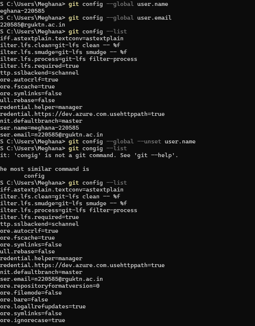

--part 2:repository setup commands:
1.git init:
command name:git init
syntax:git init
purpose:creates a new git repository in your project folder.
it creates a hidden  .git folder .
 screenshot: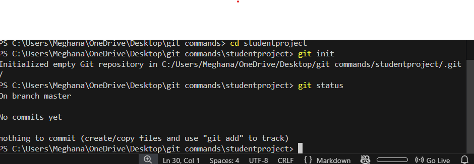

 2.git clone
 syntax:git clone <repository-url>
 purpose:copies a repository from github to your computer.
 example:git clone https://github.com/username/project.git
 
screenshot: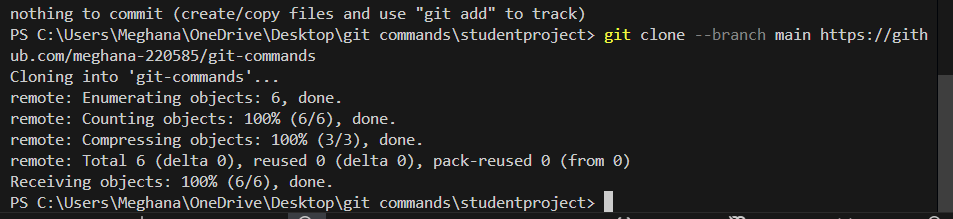

3.git clone --branch branch-name repository -url
purpose:clones only a specific branch

part 3:repository status and inspection commands

1.git status:
syntax:git status
purpose:shows modified files,untracked files files ready to commit
screenshot: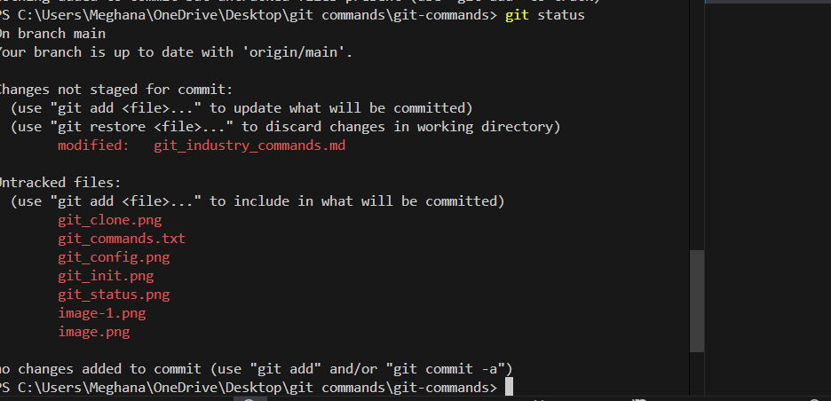

2.git log 
syntax:git log
purpose:shows full commit history
it displays commit id ,author,date,message
screenshot:

3.git log --oneline
purpose:shows commit history in short format
screenshot: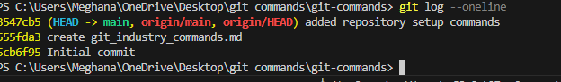

4.git log --graph
purpose:shows commit history as a tree graph (useful for branches)
screenshot: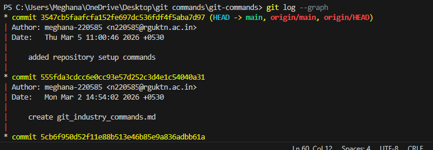

5.git show 
syntax:git show or git show commitID
purpose:shows detailed information about a commit
screenshot:

6.git diff
purpose:shows what changes you made before commiting.
screenshot: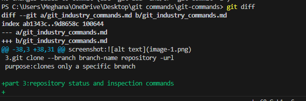

7.git diff --staged:
purpose:shows changes that are added but not commited.
screenshot: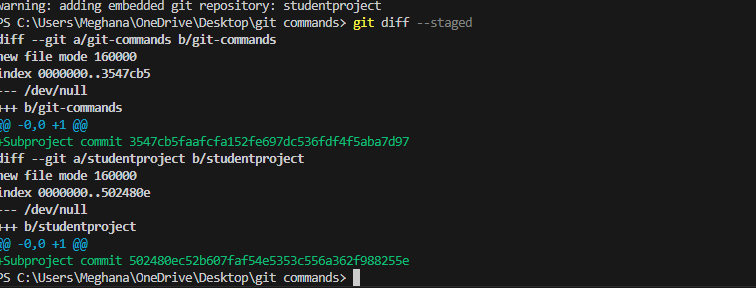

8.git blame
syntax:git blame filename
purpose:shows who modified each line in a file
screenshot: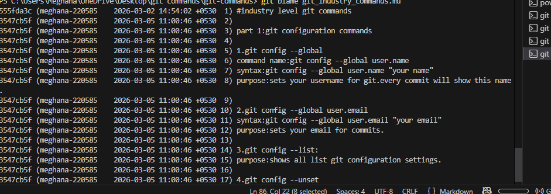

9.git reflog:
purpose:shows history of head changes (very helpful to recover lost commits)
screenshot: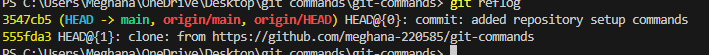

10.git shortlog:
purpose:shows summary of commits grouped by author.
screenshot: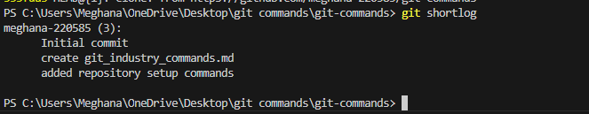

part 4:file tracking commands

1.git add
purpose:adds a specific file to the staging area
screenshot: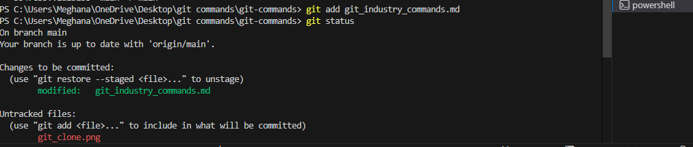
 
 2.git add .
 purpose:adds all modified files to staging area
 screenshot: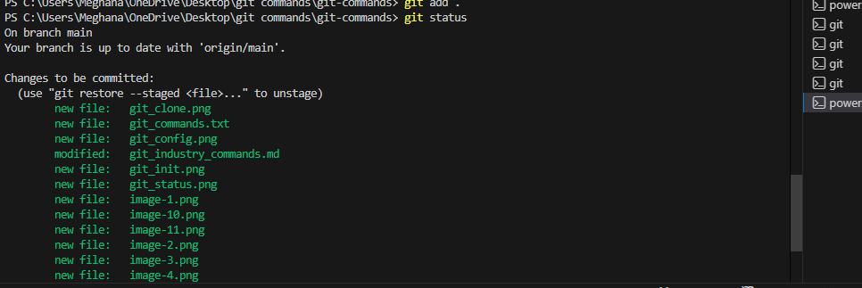

 3.git add -p
 purpose:adds changes part by part(patch by patch)

4.git restore:
syntax:git restore filename
purpose:undo changes in working directory (before staging).

5.git restore --staged
syntax:git restore --staged filename
purpose:removes file from staging area
screenshot: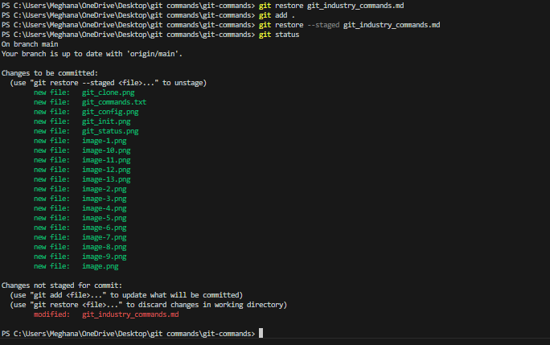

6.git rm
syntax:git rm filename
purpose:deletes file from project and git

7.git mv
syntax:git mv oldname newname
purpose:renames gile in git
